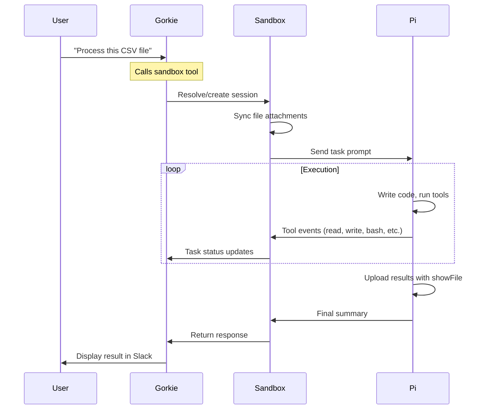

The sandbox tool is Gorkie's most powerful capability—it delegates tasks to a persistent code execution environment where Pi (a coding agent) can write code, process files, install packages, and use specialized skills.

## Overview

When you ask Gorkie to process files, run code, or perform complex data operations, it uses the `sandbox` tool to hand off work to a dedicated runtime environment.

### Key Features

- **Persistent state**: Files, code, and installed packages survive across multiple sandbox calls in the same conversation
- **Pi integration**: Powered by the Pi coding agent for intelligent code execution
- **Skills system**: Pre-installed capabilities for browser automation, email, and API integrations
- **File management**: Upload attachments, process data, generate outputs
- **Real-time updates**: See detailed progress with nested task status

---

## The sandbox Tool

### Parameters

<ParamField path="task" type="string" required>
  A clear description of what to accomplish. The sandbox remembers all previous work in this thread—files, code, and context from earlier runs are available. Reference them directly.
</ParamField>

### Returns

```typescript
{
  success: true;
  response: string; // Summary from Pi agent
}
// or
{
  success: false;
  error: string;
  task: string;
}
```

### Example Usage

<CodeGroup>

```typescript Basic data processing
{
  task: "Process the CSV file and create a bar chart showing sales by region. Save as output/sales-chart.png and upload with showFile."
}
```

```typescript With context from previous runs
{
  task: "Using the processed data from earlier, now calculate year-over-year growth rates and save to output/growth.json."
}
```

```typescript Using a skill
{
  task: "Use the agent-browser skill to open https://example.com/signup, fill the form with name: Alex Smith, email: alex@example.com, and submit. Capture confirmation screenshot."
}
```

</CodeGroup>

---

## How the Sandbox Works

### 1. Session Management

Each Slack conversation thread gets its own sandbox session:

```typescript
// First sandbox call in a thread
{
  task: "Create a Python script that fetches weather data"
}
// → Creates new E2B sandbox, starts Pi agent

// Second sandbox call in same thread
{
  task: "Run the weather script for New York"
}
// → Reuses existing sandbox, script is still there
```

Sessions are paused between calls to save resources and resumed when needed.

### 2. File Persistence

Files persist across sandbox calls within a conversation:

- **Uploads**: Slack file attachments are synced to `/home/user/uploads/`
- **Outputs**: Generated files should go in `/home/user/output/`
- **Code**: Scripts and projects remain in the working directory
- **Packages**: Installed npm/pip packages persist

### 3. Pi Agent Integration

Pi is a coding agent that:

- Writes and executes code (Python, Node.js, Bash)
- Installs packages as needed
- Uses specialized skills
- Provides structured summaries
- Uploads results with `showFile`

### 4. Keep-Alive Mechanism

Long-running tasks maintain the sandbox:

- **Heartbeat**: Every 3 minutes during execution
- **Minimum time**: Ensures at least 5 minutes remaining
- **Timeout**: Maximum execution time (configurable, typically 10-15 minutes)

---

## Available Skills

The sandbox comes pre-configured with specialized skills that extend its capabilities.

### AgentBrowser

Browser automation for public websites.

**Use cases:**
- Submit public signup/contact forms with proof screenshots
- Scrape structured text from public pages
- Reproduce UI issues and capture before/after screenshots
- Download files from public pages
- Find and download media assets from Google Images or source sites

**Workflow pattern:**
```typescript
{
  task: `Use agent-browser skill:
1. Open https://example.com/form
2. Take snapshot with 'snapshot -i'
3. Fill fields: name=Jordan Lee, email=jordan@example.com
4. Click submit button
5. Wait for confirmation page (use wait networkidle)
6. Capture screenshot and upload with showFile`
}
```

**Example:**
```typescript
{
  task: "Use the agent-browser skill to open https://example.com/event-signup, fill the form fields with: name Jordan Lee, email jordan@example.com, company Acme Labs, role Engineer, and notes Interested in AI automation workshop. Submit the form, capture the confirmation page as output/event-signup-confirmation.png, and upload it with showFile. Include a brief summary of what was submitted and the confirmation text."
}
```

---

### AgentMail

Email automation via the AgentMail API/SDK.

**Capabilities:**
- Inbox lifecycle (create/list/get/delete)
- Send/reply to messages
- Thread triage and management
- Labels and organization
- Attachment retrieval
- Draft workflows
- Multi-tenant pods

**Gorkie's email:** `gorkie@agentmail.to`

**Workflow pattern:**
```typescript
{
  task: `Use AgentMail skill:
1. List unreplied threads from last 24 hours in gorkie@agentmail.to
2. Draft concise replies for each thread (don't send yet)
3. Save triage summary to output/agentmail-triage.md
4. Upload summary with showFile
5. Include thread IDs and draft IDs in summary`
}
```

**Example:**
```typescript
{
  task: "Use AgentMail. For inbox gorkie@agentmail.to, list unreplied threads from the last 24 hours, draft concise replies for each thread (do not send yet), save a triage summary to output/agentmail-triage.md, and upload it with showFile. Include thread IDs and draft IDs in the summary."
}
```

---

### HackClub Revoker

Revoke leaked HackClub API tokens.

**Use case:**
When a user accidentally shares a HackClub API token in Slack, immediately revoke it for security.

**API:**
```typescript
// POST https://revoke.hackclub.com/api/v1/revocations
{
  "token": "...",
  "submitter": "gorkie",
  "comment": "user-reported leak in Slack"
}
```

**Example:**
```typescript
{
  task: "Use the HackClub Revoker skill to revoke token hc_live_abc123xyz456. Submit with submitter=gorkie and comment='accidental Slack share'. Report status but do NOT include the token in your response."
}
```

<Warning>
**Security note:** When reporting revocation results, never repeat the full token value in the response to the user.
</Warning>

---

## Sandbox Execution Flow

### Lifecycle



### Task Status Updates

You'll see nested progress in Slack:

```
🔄 Running sandbox
  📄 Read: data.csv
  🐍 Bash: python process.py
  ✅ Write: output/results.json
  📤 Upload: output/chart.png
✅ Sandbox complete: Processed 1,247 rows and generated chart
```

---

## Best Practices

### 1. Be Specific About Outputs

```typescript
// Good
{
  task: "Analyze sales.csv, create a bar chart showing monthly revenue, save as output/revenue-chart.png, and upload with showFile. Include total revenue in the summary."
}

// Avoid
{
  task: "Analyze the file" // Too vague
}
```

### 2. Reference Previous Work

Since state persists:

```typescript
// First call
{ task: "Download stock data for AAPL and save to data/aapl.json" }

// Second call (references first)
{ task: "Using the AAPL data from earlier, calculate 30-day moving average" }
```

### 3. Use Skills Explicitly

Mention the skill name:

```typescript
{ task: "Use agent-browser skill to scrape product prices from https://example.com/products" }
```

### 4. Structure Multi-Step Tasks

```typescript
{
  task: `Complete workflow:
1. Read uploaded PDF with PyPDF2
2. Extract text and save to data/extracted.txt
3. Use searchWeb to find related articles
4. Create markdown summary in output/summary.md
5. Upload with showFile`
}
```

### 5. Always Upload Final Results

```typescript
// End tasks with:
"...and upload with showFile"
"...capture screenshot and upload it"
"...save to output/ and use showFile"
```

---

## Limitations

<Warning>
**Important constraints:**

- **Execution timeout**: Tasks abort after configured limit (typically 10-15 min)
- **Public websites only**: AgentBrowser cannot access authenticated/private sites
- **Memory limits**: E2B sandboxes have resource constraints
- **Network restrictions**: Some external services may be blocked
- **File size limits**: Very large file uploads may fail
</Warning>

---

## Common Patterns

### Data Analysis

```typescript
{
  task: "Read sales-data.csv, calculate summary statistics (mean, median, std dev) by region, create visualizations (histogram and box plot), save all outputs to output/ and upload with showFile. Include key insights in summary."
}
```

### Web Scraping

```typescript
{
  task: "Use agent-browser to open https://news.ycombinator.com, extract the top 10 story titles and URLs, save as JSON to output/hn-top10.json, and upload with showFile."
}
```

### Email Automation

```typescript
{
  task: "Use AgentMail to check gorkie@agentmail.to inbox, list messages received in the last hour, and create a summary table with: sender, subject, received time. Save to output/recent-emails.md and upload."
}
```

### Image Processing

```typescript
{
  task: "Use PIL to resize the uploaded image to 800x600, apply a subtle blur filter, add a watermark 'Gorkie 2026' in bottom-right corner, save as output/processed.png and upload with showFile."
}
```

### API Integration

```typescript
{
  task: "Fetch weather data from OpenWeatherMap API for San Francisco (use free tier, no API key needed for basic data). Parse JSON response, extract temperature, conditions, humidity. Create a formatted markdown report in output/weather.md and upload."
}
```

---

## Debugging

### Check Session State

Ask Gorkie:
```
@gorkie what files are in the sandbox output directory?
```

Gorkie will call:
```typescript
{ task: "List files in /home/user/output/ with details (size, modified time). Show file tree." }
```

### View Logs

```typescript
{ task: "Show the last 50 lines of any error logs in the workspace" }
```

### Reset Session

Start a new thread to get a fresh sandbox session.

---

## Advanced: Sandbox Configuration

Sandbox behavior is configured in `server/config.ts`:

```typescript
export const sandbox = {
  runtime: {
    executionTimeoutMs: 15 * 60 * 1000, // 15 minutes
  },
  // ... other settings
};
```

See [E2B Sandbox](/advanced/e2b-sandbox) for architecture details.

---

## Next Steps

<CardGroup cols={2}>
  <Card title="E2B Sandbox Architecture" icon="sitemap" href="/advanced/e2b-sandbox">
    Learn about the underlying infrastructure
  </Card>
  <Card title="Chat Tools" icon="comments" href="/tools/chat-tools">
    Combine sandbox with other tools
  </Card>
  <Card title="Scheduled Tasks" icon="calendar-days" href="/features/scheduled-tasks">
    Use sandbox in recurring tasks
  </Card>
  <Card title="AgentBrowser Docs" icon="browser" href="https://github.com/vercel-labs/agent-browser" target="_blank">
    Official browser automation docs
  </Card>
</CardGroup>
